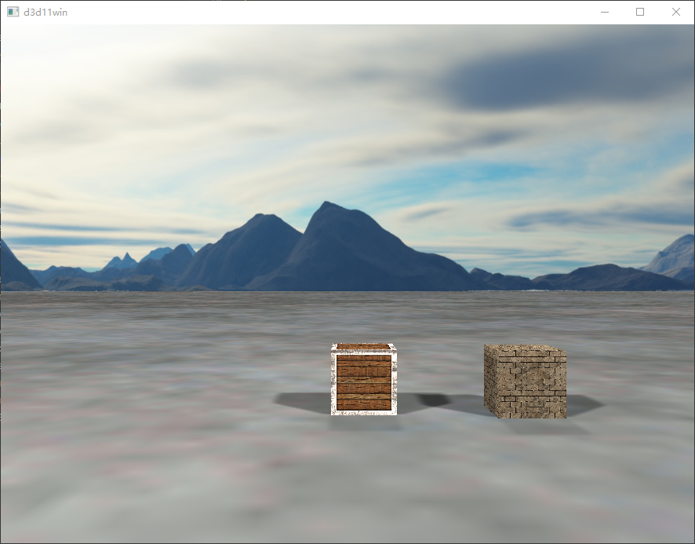

# D3D11 3D 渲染引擎 (CBrother)

一套用 [CBrother](https://www.cbrother.net/) 脚本语言直接封装 **Direct3D 11** 的轻量级 3D 渲染引擎。
无需 C++ 编译，脚本层直接调用 Win32 + D3D11 COM 接口，实现窗口、相机、网格、材质、光照（含实时阴影）、天空盒与场景图。

> 实测：使用 AMD Radeon RX 470，开启 3 个方向光阴影 + 天空盒 + 多个立方体/平面，1080P 下稳定 **60 FPS**。

---

## 特性

- **纯脚本驱动**：通过 `CLibStruct` / `CLibPointer` 直接绑定 D3D11 / Win32 API，无 FFI 封送开销。
- **前向渲染**（默认）+ **延迟渲染**（`DEFERED_SHADING_ENABLE` 可切换，GBuffer 多渲染目标）。
- **多种光照**：环境光、点光（带衰减）、方向光（带实时阴影 / PCF）。
- **实时阴影**：方向光支持阴影贴图，比较采样器使用 `CLAMP_TO_BORDER`（边界色 1.0），超出范围永不投影。
- **天空盒**：从 6 张图加载立方体贴图（顺序遵循 D3D `+X/-X/+Y/-Y/+Z/-Z` 约定）。
- **场景图**：`Scene3D` 管理灯光与子节点（`Cube` / `Plane` / `SkyBox` 等），自动递归变换。
- **资源管理层**：`TextureManager` / `MaterialManager` / `ShaderManager` 单例管理共享资源。
- **内置数学库**：`glm.cb` 提供 `vec3` / `mat4` / 正交投影 / 透视投影等（兼容 GLM 语义）。
- **WIC 贴图解码**：通过 Windows Imaging Component 直接加载 png/jpg 等格式。

---

## 工程结构

| 文件 | 作用 |
|---|---|
| `d3d11.cb` | D3D11 常量枚举与所有 COM 接口封装（设备、上下文、缓冲、视图、采样器等），已经随CBrother V2.5.8版本归入标准库,位置：/lib/windows/d3d11.cb |
| `glm.cb` | 向量/矩阵数学库，已经随CBrother V2.5.8版本归入标准库，位置:/lib/glm.cb |
| `d3d11win.cb` | 应用入口：窗口创建、`onCreate()` 初始化、`renderFrame` 渲染循环、键盘/resize 消息处理 |
| `d3ddevice.cb` | `D3DDevice` 类：交换链、设备/上下文、深度缓冲、渲染主循环 `renderFrame()` / `resizeSwapChain()` |
| `define.cb` | 全局常量与单例对象（`g_d3d` / `g_view3d` / `g_textureManager` 等）、绘制类型、阴影图尺寸 |
| `Camera.cb` | 第一人称相机（键盘 WASD + QE 升降、方向键转视角） |
| `View3d.cb` / `Scene3D.cb` / `Scene.cb` | 视口、3D 场景、场景节点基类 |
| `Mesh.cb` / `Cube.cb` / `Plane.cb` / `SkyBox.cb` / `Sprite3D.cb` | 可绘制网格与几何体 |
| `Material.cb` / `MaterialManager.cb` | 材质（反照率/高光贴图） |
| `Light.cb` / `LightManager.cb` | 光照类型与常量缓冲管理 |
| `Texture.cb` / `TextureManager.cb` / `Image.cb` | 贴图加载（图片 / 程序化 / 立方体贴图）、WIC 解码 |
| `Shader.cb` / `ShaderManager.cb` | HLSL 着色器加载与绑定 |
| `hlsl/` | 着色器源码（`commonlight.hlsli` 内含 PCF 阴影与光照计算） |
| `res/` | 示例贴图与天空盒图片 |

---

## 快速开始

1. 安装 [CBrother](https://www.cbrother.com/) 运行时。
2. 确保运行环境已加载正常的 **显卡驱动**（代码 31 软渲染状态会严重掉帧）。
3. 在项目根目录运行入口脚本：

   ```bash
   cbrother d3d11win.cb
   ```

4. 窗口出现后：
   - `W` / `S` / `A` / `D`：前 / 后 / 左 / 右移动相机
   - `Q` / `E`：升 / 降
   - 方向键：转动视角
   - 拖拽窗口边缘：自动重建交换链与视口

---

## 引擎用法（基于 `onCreate()` 初始化流程）

所有初始化动作都在 `D3D11Win::onCreate()` 中完成，依次对应引擎的核心用法：

### 1. 初始化 D3D11 设备

```cb
g_d3d.Init(m_hWnd, width, height);   // 用窗口句柄 + 客户区尺寸创建交换链/设备/深度缓冲
```

`m_hWnd` 由 `CustomWindow` 基类提供，`width/height` 取自 `getClientRect()`。

---

### 2. 加载并注册贴图

```cb
var tex = new Texture(GetRoot() + "res/container2.png");
g_textureManager.AddTexture("container2.png", tex);   // 以 key 注册，后续材质按 key 引用
```

支持 png / jpg 等（WIC 解码）。立方体天空盒需按 **`+X,-X,+Y,-Y,+Z,-Z`** 顺序提供 6 张图：

```cb
var vec = [ right, left, top, bottom, front, back ];  // 绝对路径
var skyboxtexture = new Texture();
skyboxtexture.LoadTextureCube(vec);
g_textureManager.AddTexture("skybox", skyboxtexture);
```

---

### 3. 创建材质并绑定贴图

```cb
var cubeMaterial = g_materialManager.CreateNormalMaterial();
cubeMaterial.SetAlbedoTexturKey("container2.png");     // 反照率贴图（按 TextureManager 的 key）
cubeMaterial.SetSpecularTexturKey("container2_specular.png");
```

---

### 4. 创建视口与相机

```cb
g_view3d = new View3D(new DarwRect(0, 0, width, height));
g_view3d.SetCameraPostion(glm::vec3(0, 2, 10));        // 相机初始位置
g_view3d.SetViewRect(new DarwRect(0, 0, width, height));
```

相机控制接口在 `Camera.cb`：`ProcessKeyboard(dir, step)`、`ProcessMouseMovement(x, y, constrainPitch)`。

---

### 5. 构建场景与添加灯光

```cb
var s3d = new Scene3D();
g_view3d.SetScene(s3d);

// 环境光
var ambient = new AmbientLight();
ambient.SetAmbientColor(255 * 0.1, 255 * 0.1, 255 * 0.1);
s3d.AddLight(ambient);

// 点光（带衰减）
var pl = new PointLight(255, 255, 255);
pl.SetPosition(glm::vec3(-6, 6, 6));
pl.SetAttenuation(PLA_100);
s3d.AddLight(pl);

// 方向光（带实时阴影）
var dl = new DirectionLight(255, 255, 255);
dl.SetPosition(glm::vec3(-50, 50, 50));
dl.SetCastShadows(true);
s3d.AddLight(dl);
```

> 方向光数量上限 `LIGHT_MAX_DIRECTION = 4`；点光上限 `LIGHT_MAX_POINT = 4`（见 `define.cb`）。
> 每多一个 `CastShadows` 的方向光，每像素多一次阴影图 PCF 采样——是主要性能变量。

---

### 6. 添加可绘制对象

```cb
var skybox = new SkyBox();
skybox.SetMaterial(skyboxMaterial);
s3d.AddChild(skybox);                  // 加入场景图

var cube = new Cube();
cube.SetMaterial(cubeMaterial);
cube.SetPosition(0, 0.5, 0);
s3d.AddChild(cube);

var plane = new Plane();
plane.SetMaterial(planeMaterial);
plane.Rotate(-90, glm::vec3(1, 0, 0)); // 绕 X 轴旋转 -90° 平放
plane.SetScale(glm::vec3(300.0, 300.0, 1.0));
s3d.AddChild(plane);
```

`Scene3D` 会在每帧递归遍历子节点，应用世界变换并绘制。

---

### 7. 渲染循环（消息驱动）

主循环在 `run()` 中，重写了CustomWindow的run接口：有窗口消息时分发（`WM_SIZE` 触发 `resizeSwapChain` 重建缓冲），无消息时每帧调用：

```cb
g_d3d.renderFrame();   // 清屏 → 阴影 pass → 天空盒 → 场景 → 提交
```

---

## 配置（define.cb）

| 常量 | 默认 | 说明 |
|---|---|---|
| `LIGHT_DEPTH_MAP_SIZE` | 1024 | 方向光阴影贴图分辨率（512 可提速、近处略糊）|
| `LIGHT_MAX_POINT` | 4 | 点光数量上限，修改后着色器里也要修改 |
| `LIGHT_MAX_DIRECTION` | 4 | 方向光数量上限，修改后着色器里也要修改 |
| `DEFERED_SHADING_ENABLE` | false | 切换前向 / 延迟渲染 |

---

## 性能与调试

- 关掉部分方向光的 `SetCastShadows(false)` 可显著降低 `present` 耗时。
- PCF 采样在 `hlsl/commonlight.hlsli` 的 `CalcDirectionLightShadow`；越界坐标由比较采样器 `BORDER`(1.0) 处理，无需在 shader 中手动裁剪。
- 渲染耗时日志：`renderFrame` 内可打印 `draw` / `present` 耗时（见 `d3ddevice.cb`）。

---

## 许可

详见仓库 LICENSE（如有）。

## 运行效果
